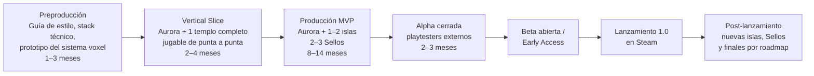

# De GDD a Steam: Plan de Producción para *Proyecto Isla Ancestral*

**Documento de planificación técnica, artística y de negocio**
Elaborado a partir del GDD y la Biblia Narrativa que ya tenés escritos · Agosto 2026

---

## Cómo usar este documento

Ya tenés algo que muy pocos proyectos indie tienen en esta etapa: un GDD sólido y una biblia narrativa completa, coherente y con una filosofía de diseño clara ("construir no es imponer, es colaborar"). Eso no es poca cosa — es el 100% del trabajo de *diseño*. Lo que falta es todo lo demás: ingeniería, arte, audio, producción, plataforma y negocio.

Este documento está organizado como una auditoría de huecos: para cada disciplina, qué existe hoy (tu GDD/narrativa), qué falta técnicamente, y qué decisiones tenés que tomar. Hay una sección específica y detallada sobre tu pregunta central — usar IA con acceso a herramientas (MCP) contra Blender/Unity/Godot — con el estado real de esas herramientas a agosto de 2026.

Te lo digo de entrada porque es la parte más importante y la que más impacto tiene en todo lo que sigue: **la Sección 1 es una lectura obligatoria antes que las demás.** El alcance tal como está escrito en el GDD es enorme — no en un sentido retórico, sino en el sentido literal de "esto es varios juegos completos combinados". No te lo digo para bajarte los brazos, te lo digo porque la diferencia entre los proyectos indie que se terminan y salen a la venta y los que se quedan en desarrollo eterno casi siempre pasa por esta decisión, tomada temprano y a conciencia.

### Índice

1. [Diagnóstico honesto de alcance](#1-diagnóstico-honesto-de-alcance)
2. [Motor y arquitectura técnica](#2-motor-y-arquitectura-técnica)
3. [Desglose técnico de los sistemas de gameplay](#3-desglose-técnico-de-los-sistemas-de-gameplay)
4. [Pipeline de arte y contenido 3D](#4-pipeline-de-arte-y-contenido-3d)
5. [IA generativa + MCP: Blender, Unity y Godot](#5-ia-generativa--mcp-blender-unity-y-godot)
6. [Audio: música, SFX y middleware](#6-audio-música-sfx-y-middleware)
7. [Narrativa técnica: implementar lo que ya escribiste](#7-narrativa-técnica-implementar-lo-que-ya-escribiste)
8. [UI/UX y accesibilidad](#8-uiux-y-accesibilidad)
9. [Producción: equipo, herramientas y flujo de trabajo](#9-producción-equipo-herramientas-y-flujo-de-trabajo)
10. [QA, testing y optimización](#10-qa-testing-y-optimización)
11. [Steam: todo lo específico de la plataforma](#11-steam-todo-lo-específico-de-la-plataforma)
12. [Legal, administrativo y fiscal](#12-legal-administrativo-y-fiscal)
13. [Marketing y visibilidad](#13-marketing-y-visibilidad)
14. [Modelo de negocio y precio](#14-modelo-de-negocio-y-precio)
15. [Presupuesto y financiamiento](#15-presupuesto-y-financiamiento)
16. [Roadmap de desarrollo por fases](#16-roadmap-de-desarrollo-por-fases)
17. [Panorama competitivo: qué estudiar](#17-panorama-competitivo-qué-estudiar)
18. [Riesgos principales y mitigación](#18-riesgos-principales-y-mitigación)
19. [Checklist maestro final](#19-checklist-maestro-final)
20. [Fuentes y lecturas recomendadas](#20-fuentes-y-lecturas-recomendadas)

---

## 1. Diagnóstico honesto de alcance

### Lo que realmente pediste construir

Si separás el GDD y la narrativa en sistemas independientes, esto es lo que tenés sobre la mesa:

| Sistema | Referencia de género | Complejidad real |
|---|---|---|
| Terreno voxel modificable en tiempo real | Minecraft | Motor propio, no es "un plugin y listo" |
| Simulador de vida cozy (economía, afecto, tareas diarias) | Stardew Valley / Animal Crossing | Sistemas de progresión y balance profundos |
| 6 templos con mecánica de puzzle **única** cada uno + herramienta única cada uno | Zelda (Ocarina of Time → TOTK) | Diseño de nivel especializado, el más caro de producir |
| 6+ biomas/islas completamente diferenciados en arte, fauna, flora y NPCs | Genshin Impact / Pokémon (regiones) | Multiplica el costo de arte por cada isla |
| Capa oceánica completa: pesca, buceo, submarino, ruinas sumergidas por niveles de profundidad | Subnautica | Un sub-juego en sí mismo |
| Ciclo de estaciones con secretos exclusivos por estación | Stardew Valley (versión simple) / Animal Crossing (versión compleja) | Depende de cuánto contenido sea estación-exclusivo |
| 4 finales distintos + contenido post-final ("Era del Alba") | Persona / Nier | Rutas narrativas y de mundo divergentes |
| Narrativa profunda con lore en capas (Arquitectos del Alba, Primeros Jardineros) | Hollow Knight / Outer Wilds | Ya la tenés escrita — esto es una fortaleza real |

No es una crítica al diseño — de hecho el diseño es *bueno*, está bien pensado y tiene una filosofía coherente de principio a fin, algo que muchos GDD no logran. El problema no es la calidad del diseño, es el **volumen** de producción que ese diseño implica.

### Comparación con proyectos reales

| Juego | Equipo | Tiempo | Qué NO incluía (vs. tu alcance completo) |
|---|---|---|---|
| **Stardew Valley** | 1 persona (Eric Barone), con ayuda externa recién para el port/localización | ~4.5 años a tiempo completo | Sin terreno voxel, sin dungeons con herramienta única cada una, un solo mapa central |
| **Dinkum** | 1 persona al inicio, equipo pequeño después | Early Access desde 2022, en desarrollo activo varios años | Sin templos de puzzle con mecánicas exclusivas, sin voxel real (usa grid + props) |
| **Craftopia** | Equipo chico (Pocket Pair, antes de Palworld) | Early Access multi-año, todavía iterando | Sin la profundidad de historia ni NPCs con arcos propios |
| **My Time at Portia / Sandrock** | Pathea Games, ~30-50 personas | 3-4 años cada título | Sin voxel real (props sobre grilla), mazmorras más simples |
| **Zelda: BOTW/TOTK** (referencia de calidad de puzzle) | Cientos de personas, Nintendo | 4-6 años por título | — (es la vara de calidad para "templo con herramienta única", no un comparable de tamaño de equipo) |

La fila de Zelda no está para intimidar: está para calibrar. Cuando el GDD dice "templo con mecánica exclusiva y herramienta exclusiva", el género de referencia de calidad es el de mayor costo de producción por hora de contenido que existe en el diseño de niveles. Eso no significa que no se pueda hacer con recursos indie — significa que **cada templo que agregues al alcance inicial es una decisión de producción cara**, no un ítem más de una lista.

### La buena noticia (y es real, no un consuelo)

Tu propia estructura narrativa ya está diseñada para expandirse por partes: el "Gran Vapor" que llega una vez al mes, las islas que se desbloquean de a una, la "Era del Alba" como etapa post-historia principal — todo eso es, sin que lo hayas planteado así, **una arquitectura de Early Access o de actualizaciones post-lanzamiento ya integrada en la ficción**. No vas a tener que "cortar" tu visión para lanzar algo viable: la vas a poder lanzar en el orden en que la propia historia la despliega.

Esto es exactamente lo que hicieron **Stardew Valley** (contenido gratuito post-lanzamiento durante años), **Terraria**, **Subnautica** (Early Access con el mundo dividido en biomas de profundidad creciente) y **Dinkum** (Early Access con expansión de isla progresiva). No es una segunda opción — es la estrategia más probada que existe para juegos de este tamaño hechos por equipos chicos.

### Recomendación de alcance para la v1.0

- **Isla Aurora completa** (el hub, siempre necesario).
- **1-2 islas adicionales** vía el Gran Vapor (ej. Isla de Coral y/o Isla Verde).
- **2-3 Sellos obtenibles** (Brisa + Marea, por ejemplo) con sus templos y herramientas.
- **Un cierre narrativo satisfactorio** aunque parcial — no hace falta el Sello del Alba ni Elysia en el día 1. Podés terminar la v1.0 en un punto de la historia que se sienta completo (ej. el descubrimiento de que Aurora está conectada a algo más grande) y dejar el resto como **hoja de ruta pública post-lanzamiento** (gratis o como expansión paga — ver Sección 14).
- El resto del GDD (Isla de las Cenizas, Islas del Cielo, Elysia, los 4 finales, el sistema oceánico completo con submarino) se planifica como **roadmap de contenido**, no como parte del lanzamiento.

Esto no es "hacer un juego más chico". Es la diferencia entre un juego que existe y uno que no.

---

## 2. Motor y arquitectura técnica

El GDD deja abierta la elección entre Unity y Godot. Es una decisión que conviene cerrar antes de escribir la primera línea de código, porque migrar un sistema voxel de un motor a otro más adelante es, en la práctica, empezar de nuevo.

### Unity vs. Godot para este proyecto específico

| Criterio | Unity | Godot 4.x |
|---|---|---|
| Costo | Personal: gratis hasta USD 200.000 de ingresos/financiamiento anual. Pro: ronda los USD 2.300/asiento/año superado ese umbral (precio actualizado en enero 2026) | Gratis siempre, sin importar ingresos. Licencia MIT, sin regalías ni fee por instalación |
| Historial de confianza | El "Runtime Fee" de 2023 generó una fuga masiva a Godot/Unreal; Unity lo canceló por completo en septiembre 2024 y volvió al modelo por asiento. La confianza se está reconstruyendo pero el episodio es reciente | Sin sobresaltos de licencia — es su principal argumento de venta frente a Unity |
| Voxel terrain nativo | No trae nada nativo; hay que integrar assets de terceros o construir desde cero | Existe un módulo C++ hecho específicamente para esto: **Voxel Tools** (godot_voxel, de Zylann), con terreno editable en tiempo real, colisiones tipo Minecraft, streaming de chunks infinito, LOD con Transvoxel para terreno suave. Es, literalmente, el caso de uso que tu juego necesita |
| Animación de personajes | Mecanim/Timeline: más maduro, más tutoriales, mejor soporte de retargeting | Mejoró mucho en Godot 4 pero el ecosistema de tutoriales y asset packs es más chico |
| Asset Store / mercado de terceros | Enorme — texturas, shaders, sistemas de diálogo, plugins de economía, todo ya existe para comprar | Más chico, en crecimiento, más GDScript/C# hecho a mano |
| Bolsa de talento para contratar freelancers | Mucho más grande — más fácil encontrar artistas técnicos, programadores gameplay, etc. | Comunidad más chica pero muy activa y motivada; cuesta más encontrar gente con experiencia comercial |
| Herramientas de IA + MCP (tu pregunta central) | MCP oficial de Unity (Unity AI, en beta) + el proyecto comunitario **Unity MCP** de CoplayDev, con más de 12.700 estrellas en GitHub y desarrollo activo (v10.1.0, julio 2026), MIT, gratis para uso comercial | Varios servidores MCP comunitarios sólidos (GDAI MCP, godot-mcp, Fennara MCP) con captura de pantalla, inspección de escena y depuración — no hay todavía un "oficial" de primera parte como el de Unity, pero la oferta comunitaria es robusta |
| Rendimiento en voxels a gran escala | Depende 100% de qué asset/paquete elijas e implementes vos | El módulo de Voxel Tools está escrito en C++/GDExtension específicamente pensado para rendimiento en este escenario |
| Exportación multiplataforma (Steam Deck incluido) | Excelente, muy probado | Excelente, muy probado, y con la ventaja de que corre nativo en Linux/SteamOS sin depender de Proton para el propio editor |

### Recomendación

Para **este proyecto puntual** —terreno voxel como pilar central, equipo chico o solo, sin presupuesto asegurado todavía— **Godot 4.x es la opción más defendible por defecto**: el costo cero pase lo que pase con tus ingresos, sumado a que el problema técnico más difícil de tu juego (terreno voxel editable, con streaming y buen rendimiento) ya tiene un módulo comunitario maduro construido específicamente para resolverlo, son dos ventajas que pesan mucho para un equipo con recursos limitados.

Elegí **Unity** en cambio si: ya tenés (o vas a conseguir) presupuesto para contratar freelancers de animación de personajes con expectativa de trabajar en un motor "de industria"; priorizás la cantidad de tutoriales/soluciones ya hechas por sobre el costo cero; o el equipo ya tiene experiencia previa fuerte en C#/Unity y reaprender no compensa.

No hay una respuesta "incorrecta" acá — es una decisión de trade-offs reales. Lo que sí es un error es no decidir y probar los dos en paralelo por mucho tiempo.

### Arquitectura del sistema voxel (independiente del motor)

Sea cual sea el motor, el sistema de terreno necesita resolver estos problemas técnicos, todos mencionados o implícitos en tu GDD:

- **Chunking**: el mundo se divide en bloques de, por ejemplo, 16×16×16 o 32×32×32 voxels. Nunca se procesa el mundo entero de una vez.
- **Mesh culling / greedy meshing**: tu GDD ya lo pide explícitamente ("renderización única de caras visibles"). Es la técnica que evita dibujar las caras de voxels que están tapadas por otros voxels — sin esto, el juego no llega a 60 FPS ni cerca.
- **Generación en hilos secundarios (threading)**: generar y remallar chunks no puede bloquear el hilo principal o vas a tener microfreezes cada vez que el jugador cava un bloque.
- **LOD (nivel de detalle)**: los chunks lejanos se renderizan con menos detalle. Esto importa más en tus islas grandes y en el océano.
- **Persistencia de modificaciones**: acá está el problema técnico más subestimado de los juegos voxel. No podés guardar "el mundo entero" en cada autoguardado — necesitás un sistema de **diffs por chunk** (qué bloques cambiaron respecto a la generación original) que se serializa de forma incremental. Esto se vuelve más complejo todavía cuando el jugador visita 6+ islas distintas y tenés que decidir si cada una vive en memoria, se descarga a disco, o ambas.
- **Colisiones**: las herramientas del jugador (pala, pico, hacha) necesitan raycasting preciso contra la grilla de voxels, no contra la malla renderizada (que cambia constantemente).
- **Streaming entre islas**: dado que cada isla mensual es, en la práctica, un nivel/escena distinto, definí temprano si el mundo es "una escena gigante con streaming" o "escenas separadas que se cargan con una pantalla de carga en el viaje en barco". La segunda opción es muchísimo más simple de implementar y de optimizar, y narrativamente el viaje en barco te da una excusa perfecta para una carga con diégesis (ver el barco navegando, etc.).

---

## 3. Desglose técnico de los sistemas de gameplay

Cada sistema del GDD, traducido a lo que hay que construir realmente:

### 3.1 Terreno y construcción
- Herramientas (Pala, Pico, Hacha) con "Eficacia de Recolección" como stat, según ya definiste — esto es un sistema de datos (ScriptableObjects en Unity / Resources en Godot) más que de código nuevo por herramienta.
- Sistema de inventario de bloques con stacking, y UI de "hotbar" para selección rápida.
- Reglas de qué bloques pueden colocarse sobre cuáles (evitar que el jugador rompa el diseño de las ruinas, por ejemplo, si eso es una restricción narrativa).

### 3.2 Economía y progresión
- Doble moneda (Gemas de Ámbar / Pases de Mérito) implica dos sistemas de "wallet" separados con sus propias reglas de qué se puede comprar con cada una.
- Sistema de tareas diarias con rotación (necesita un generador/pool de tareas, no tareas hardcodeadas una por una).
- Curva de precios de mejoras de infraestructura (Finneas) — esto es balance de diseño tanto como código; conviene modelarlo en una hoja de cálculo antes de tocar el motor.

### 3.3 NPCs, diálogo y afecto
- Sistema de "friendship points" por NPC (patrón estándar tipo Stardew Valley/Animal Crossing): valor numérico + umbrales que disparan diálogo nuevo, regalos, eventos de historia.
- Motor de diálogo con árboles/nodos — no lo escribas a mano en código; usá un editor de diálogo (herramientas como el sistema de nodos de Godot, o plugins de Unity tipo Yarn Spinner/Ink) para que vos (o un futuro escritor) puedan iterar sin tocar C#/GDScript.
- Reactividad ambiental: que Nilo comente si destruiste un bosque, que Lía reaccione a nuevas semillas — esto requiere un sistema de "flags de estado del mundo" consultable desde diálogo, pensado desde el día uno o se vuelve espagueti rápido.

### 3.4 Puzzles y templos: construilo como un framework, no como 6 juegos distintos
Esta es la recomendación técnica más importante de esta sección. En lugar de programar 6 mecánicas de puzzle completamente separadas (luz/espejos, presión/deslizantes, gancho, semillas, varas de flujo, y lo que sea para Brasa/Cielo/Alba), construí:
- Un **framework genérico de "emisor → receptor"**: cualquier objeto puede emitir una señal (luz, presión, agua, viento) y cualquier otro puede recibirla y disparar una acción (abrir puerta, mover plataforma). La "Red de Luz" y las "Placas de Presión" son, en el fondo, el mismo sistema con distinto flavor visual.
- Cada templo nuevo se convierte en **componer piezas existentes con una skin temática distinta**, no en programar un juego nuevo. Esto es lo que hace viable, en términos de tiempo real, tener 6 templos en vez de 2.
- Las herramientas del jugador (Gancho, Lanza-Semillas, Varas de Flujo) son "inputs" que activan receptores específicos — diseñalas como componentes conectables al mismo framework.

### 3.5 Calendario, estaciones y eventos
- Un reloj de juego (día/noche + estación + fecha) que otros sistemas escuchan (patrón *observer*/eventos): cultivos, NPCs, disponibilidad de recursos y el propio Gran Vapor reaccionan a este reloj central.
- El "Gran Vapor" mensual necesita lógica de disponibilidad de boletos condicionada al progreso de historia (Sello obtenido) — es, en esencia, un sistema de quests con prerequisitos.

### 3.6 Viaje entre islas
- Definí explícitamente (ver Sección 2) si es streaming continuo o carga por escena. Para el tamaño de este proyecto, escenas separadas con pantalla de carga diegética (el barco navegando) es la opción más razonable en costo/beneficio.

### 3.7 Océano, buceo y submarino
- Es, en la práctica, un sub-sistema de movimiento adicional completo: natación, buceo con límite de oxígeno o herramienta que lo permita, física de submarino, niveles de profundidad con distinta luz/visibilidad/fauna. Tratalo como su propio hito de producción, no como una feature más de la lista — es probablemente el sistema más caro de todo el GDD después de los templos.

### 3.8 Sistema de guardado
- Además de la persistencia de voxels (3.7 más arriba), necesitás guardar: inventario, moneda, relaciones con NPCs, progreso de historia/Sellos, estado de cultivos, fecha/estación actual, y qué islas fueron visitadas/desbloqueadas. Diseñalo como un único "GameState" serializable versionado desde el principio — agregar versionado desde el día uno evita el dolor de cabeza de "actualicé el juego y se rompieron los guardados viejos" más adelante.

---

## 4. Pipeline de arte y contenido 3D

Tu estética "Cozy Voxel" implica dos pipelines de arte conviviendo: terreno de bloques (procedural en su mayoría) + props/personajes/muebles con modelado estilizado tradicional. Son dos flujos de trabajo distintos que hay que planificar por separado.

### 4.1 Dirección de arte
- Antes de modelar nada: una **guía de estilo** (paleta de colores por bioma, proporciones de personaje, reglas de "low-poly redondeado" — cuántos lados mínimo/máximo tiene un objeto, qué nivel de detalle de textura). Sin esto, cada isla nueva corre el riesgo de sentirse hecha por un equipo distinto.
- Referencias visuales concretas por isla/bioma (moodboards) antes de tocar Blender.

### 4.2 Modelado y texturizado
- Blender es la herramienta correcta para esto (gratis, estándar de la industria indie, y como vas a ver en la Sección 5, es también la mejor integrada con IA vía MCP).
- Definí un presupuesto de polígonos por categoría de objeto (personaje, mueble pequeño, mueble grande, prop de decoración) — esto es lo que te va a permitir mantener 60 FPS con muchos objetos en pantalla.
- Texturizado: para el estilo "cozy" con paleta pastel, un enfoque de texturas simples + vertex color o un shader tipo toon/celda suele rendir mejor y ser más rápido de producir en volumen que texturizado PBR fotorrealista completo.

### 4.3 Animación de personajes
- Lía, Bruno, Nilo, Vera, Finneas y cada vecino adicional necesitan: idle, caminar, animación de "reacción" a regalos/diálogo, y gestos únicos de personalidad (el GDD ya define arquetipos — "el soñador", "el entusiasta" — que deberían verse en cómo se mueven, no solo en el diálogo). Esta es, históricamente, una de las partes que más diferencia un juego cozy que "engancha" de uno que se siente genérico, y es la que menos se beneficia de automatización total (ver 5.5).

### 4.4 VFX e iluminación
- El GDD pide iluminación global suave vía URP (Universal Render Pipeline, si es Unity) — el equivalente en Godot es su pipeline "Forward+" con Global Illumination (SDFGI o voxel GI). Ambos motores lo resuelven bien en 2026.
- VFX "satisfactorios" (ASMR, como pide el GDD) para picar/cosechar/construir: partículas simples + sonido son más importantes acá que shaders complejos — es el tipo de feedback que hace o rompe la sensación "cozy".

### 4.5 UI Art
- Inventario, diálogo, mapa, crafteo: consistencia visual con la paleta pastel general. Es contenido de arte propio, no subestimes el tiempo — un juego cozy vive y muere por lo agradable que se siente navegar sus menús.

---

## 5. IA generativa + MCP: Blender, Unity y Godot

Esta es la sección que pediste específicamente, así que vamos al detalle técnico real y actualizado (agosto de 2026).

### 5.1 Qué es MCP, en una frase

**MCP (Model Context Protocol)** es un estándar abierto de Anthropic (lanzado a fines de 2024) que le permite a un modelo como Claude conectarse directamente a herramientas externas — no solo "hablar sobre" Blender o Unity, sino leer su estado real y ejecutar acciones dentro de ellos. Cada aplicación (Blender, Unity, Godot) expone un "servidor MCP" que actúa de traductor entre el protocolo y la API interna de esa herramienta. Un cliente MCP —en tu caso, **Claude Code** (la herramienta de línea de comandos/agente de Anthropic) o **Claude Desktop**— se conecta a ese servidor y puede llamar a esas funciones durante la conversación.

Eso es literalmente "darle ojos" a la IA: además de generar código o texto, la IA puede pedir una captura de pantalla del viewport o del juego corriendo, verla, y decidir su siguiente paso en base a lo que efectivamente ve — no a lo que asume que hizo.

### 5.2 Blender + MCP: dos caminos, ambos válidos hoy

**Camino A — Conector oficial (Anthropic × equipo de Blender).** El 28 de abril de 2026, Anthropic lanzó "Claude for Creative Work", un paquete de conectores construidos sobre MCP para herramientas creativas (Blender, Adobe Creative Cloud, Autodesk Fusion, SketchUp, Ableton, Splice, Affinity, entre otros). El conector de Blender fue construido por el propio equipo de desarrollo de Blender y está pensado para: inspeccionar y depurar escenas completas (objetos, materiales, stack de modificadores, grafos de shaders), aplicar cambios por lote a muchos objetos a la vez, y —usando la API de Python de Blender (`bpy`)— agregarle herramientas nuevas al propio Blender. Anthropic además donó fondos al desarrollo de la API de Python de Blender para sostener este tipo de integraciones a futuro.

**Camino B — `blender-mcp` (proyecto comunitario de código abierto, Siddharth Ahuja).** Es anterior al conector oficial, sigue activo y mantenido, y es más específico para *creación* de escena completa por lenguaje natural: crear/modificar objetos, materiales, iluminación y cámaras; ejecutar código Python arbitrario dentro de Blender; tomar capturas del viewport (el "ojo" que pediste); e integrarse con librerías externas de assets como Poly Haven (HDRIs, texturas, modelos) y Sketchfab, además de generación de mallas por IA vía Hyper3D Rodin. Es gratuito, funciona con Claude Desktop, Claude Code o la API, y también con otros modelos vía OpenRouter si en algún momento querés comparar resultados.

En la práctica, para tu proyecto conviene tener **los dos configurados**: el oficial para depuración/inspección profunda y scripting con la API real de Blender, y `blender-mcp` para las tareas de "armame/ajustame esta escena mirando el resultado" del día a día. Requisitos técnicos: Blender reciente (4.x o 5.x según el conector), Python 3.10+, y el gestor de paquetes `uv` para instalar el servidor.

### 5.3 Unity + MCP

**Camino A — MCP oficial de Unity.** Unity lanzó en 2026, como parte de "Unity AI" (en beta), un servidor MCP de primera parte integrado directamente en el editor. Le da a agentes como Claude Code, Cursor, Windsurf o VS Code Copilot acceso en vivo al proyecto corriendo: jerarquía de escena, GameObjects, valores de componentes, salida de consola, edición de scripts y ejecución de acciones del editor — todo sin que tengas que copiar y pegar contexto manualmente.

**Camino B — Unity MCP comunitario (CoplayDev, antes IvanMurzak).** Es, a agosto de 2026, uno de los proyectos MCP para motores de juego más adoptados que existen: más de 12.700 estrellas en GitHub, desarrollo activo (v10.1.0, julio 2026), licencia MIT (uso comercial libre) y más de 25 herramientas expuestas (`manage_gameobject`, `batch_execute`, captura de pantalla de un GameObject aislado, y más). Se instala como paquete de Unity vía Package Manager apuntando directo al repositorio de GitHub. Funciona con Claude Desktop, Claude Code, Cursor, VS Code Copilot y Windsurf.

Con cualquiera de los dos, un flujo típico es: le pedís a Claude Code que cree o ajuste un GameObject, un material o un script; Claude ejecuta la acción vía MCP; le pedís que capture el Game View; Claude la analiza y corrige lo que haga falta — cerrando el mismo loop de "ver y ajustar" que con Blender.

### 5.4 Godot + MCP

Godot no tiene todavía un servidor MCP "oficial" de primera parte como el de Unity, pero la oferta comunitaria es amplia y de buena calidad, y varias ya incluyen captura de pantalla automática tanto del editor como del juego corriendo:
- **GDAI MCP Plugin** (3ddelano): crea escenas/nodos/scripts, lee errores del depurador, y desde una actualización reciente toma capturas automáticas para "entender visualmente" el editor y el juego en ejecución.
- **godot-mcp** (hay varias implementaciones activas — mkdevkit, slangwald, Dokujaa): inspección del árbol de escena en tiempo real, edición de nodos con integración al sistema de undo/redo del propio editor, y puente de screenshots vía sockets locales.
- **Fennara MCP**: enfocado en feedback de calidad — diagnósticos de GDScript, validación de escena, errores en tiempo de ejecución.

Si terminás eligiendo Godot como motor (ver Sección 2), cualquiera de estas opciones te da el mismo tipo de loop "acción → captura → evaluación" que en Blender y Unity.

### 5.5 El flujo de trabajo real: qué tareas SÍ conviene delegar

- **Prototipado y bloqueo (blockout) de niveles y templos**: armar rápido una versión jugable de la disposición de un templo para probar el puzzle antes de invertir en arte final.
- **Iteración de variantes procedurales**: rocas, vegetación, props de decoración de un mismo bioma — generar 10 variantes de un mismo arbusto es exactamente el tipo de tarea repetitiva que un flujo de "generar → capturar → ajustar" resuelve bien.
- **Dressing de escena y organización de assets**: aplicar cambios en lote sobre muchos objetos, reorganizar jerarquías, renombrar assets siguiendo una convención.
- **QA visual automatizado**: capturas de pantalla comparadas contra un estado esperado para detectar bugs visuales (un mueble que atraviesa el piso, un NPC mal ubicado) antes de que lo encuentre un tester humano.
- **Toda la lógica de gameplay en código (C# o GDScript)**: el sistema de voxels, la economía, el diálogo, el guardado — usar Claude Code directamente sobre el proyecto (sin pasar por Blender/Unity vía MCP, simplemente como asistente de programación agéntico) es, para un equipo chico, probablemente el uso de IA de mayor impacto de todo este documento. Es también, como vas a ver en 5.6, el uso que Steam trata como "herramienta de eficiencia" y no exige declarar.
- **Documentación técnica y mantenimiento del propio GDD** a medida que el diseño evoluciona.

### 5.6 Qué NO conviene delegarle (los límites reales)

Esto es tan importante como la lista anterior:
- **Dirección de arte distintiva.** El género cozy/voxel está saturado en 2026 (ver Sección 17) — decenas de juegos nuevos compiten por la misma estética "linda y pastel". Un pipeline de IA sin una dirección de arte humana fuerte detrás tiende a producir resultados que se ven genéricos o inconsistentes entre sí, justo lo opuesto de lo que necesitás para destacar.
- **Animación de personaje con carácter.** Los arcos de personalidad que ya escribiste (Lía la soñadora, Bruno el tranquilo) se transmiten en cómo se mueven los personajes tanto como en lo que dicen. Es una de las áreas donde el criterio y el "timing" de un animador humano siguen siendo insustituibles para lograr encanto.
- **Balance de diseño y "feel" final.** Cuánto cuesta cada mejora, qué tan rápido sube el afecto de un NPC, qué tan satisfactorio se siente picar un bloque — esto se ajusta jugando y sintiendo, no generando.
- **La escritura narrativa que ya hiciste vos.** Tu biblia narrativa tiene una voz y una filosofía consistentes de punta a punta; es, de hecho, uno de los activos más fuertes que tenés hoy. Usar IA para expandir diálogo puntual está bien, pero la mano autoral en la narrativa central conviene que siga siendo tuya.

### 5.7 Consideración de plataforma: la política de IA de Steam

Valve actualizó su política de divulgación de IA el 17 de enero de 2026, y la distinción que hace es exactamente la que separa los dos puntos anteriores:

- **Herramientas de eficiencia** (asistentes de código como Claude Code, automatización de tareas repetitivas que no llegan al jugador tal cual) están **exentas** de declaración — Valve las trata igual que cualquier otro software de productividad.
- **Contenido "pre-generado" que sí llega al jugador** (arte final, música, diálogo, mallas 3D generadas por IA que terminan en el juego shippeado) **debe declararse** en el formulario de contenido de Steamworks, y aparece públicamente en la página de la tienda bajo "Acerca de este juego".
- **Contenido "generado en vivo"** durante el juego (diálogo de NPC generado en tiempo real, por ejemplo) tiene un requisito de declaración más estricto todavía, incluyendo detallar qué salvaguardas tenés para evitar que genere contenido inapropiado — no parece ser tu caso, ya que tu narrativa es escrita y fija.

Para tu proyecto en concreto: usar Claude Code para programar, y usar Blender/Unity/Godot + MCP como *asistencia* de un proceso donde vos revisás y aprobás cada asset final, encaja cómodamente en la categoría exenta o de fácil declaración. Si en algún punto generás arte final directamente por IA sin retrabajo humano sustancial y lo shippeás así, declaralo — es un checkbox, no bloquea la revisión de Valve, y evitarlo genera un riesgo de reputación mucho mayor que el trámite en sí.

### 5.8 Setup práctico recomendado

1. Instalá **Claude Code** en el proyecto (repositorio de código del juego).
2. Conectá el servidor MCP de tu motor elegido (Unity MCP oficial o comunitario / uno de los Godot MCP) con `claude mcp add`.
3. Conectá `blender-mcp` (y opcionalmente el conector oficial) para el pipeline de arte 3D.
4. Usá Claude Code para toda la programación de sistemas de gameplay, con capacidad de correr el proyecto y leer errores en tiempo real.
5. Usá el puente a Blender/Unity/Godot específicamente para prototipado visual, iteración de variantes, y control de calidad por captura de pantalla — no como reemplazo del trabajo de dirección de arte y animación.

---

## 6. Audio: música, SFX y middleware

- El GDD pide música acústica/lo-fi en tiempo real y SFX "ASMR" — esto implica composición original (o licenciamiento cuidado, ver Sección 12) por bioma/isla, ya que cada una necesita su propia identidad sonora igual que su identidad visual.
- **Middleware**: FMOD y Wwise son los dos estándares de la industria para implementar audio adaptativo (música que cambia según hora del día, estación, o si estás en combate/explorando — en tu caso, según estación y bioma). Ambos ofrecen licencias gratuitas para equipos con presupuestos de desarrollo por debajo de ciertos umbrales (típicamente unos cientos de miles de dólares) — confirmá el umbral vigente en las páginas oficiales de FMOD y Wwise antes de comprometerte, porque estos límites se han ajustado con los años. La alternativa es el sistema de audio nativo del motor (perfectamente viable para un proyecto de este tamaño, con más trabajo manual de implementación).
- Con el conector oficial de **Splice** dentro de "Claude for Creative Work" (ver Sección 5.2), podés buscar samples libres de regalías directo desde una conversación con Claude — útil para prototipar la identidad sonora de un bioma antes de encargar composición original.
- Diseño de sonido "satisfactorio" (picar, cosechar, abrir cofres) es, como con el VFX, más sobre timing y capas de sonido que sobre calidad de grabación per se — es un rubro donde vale la pena iterar mucho con playtesters reales.

---

## 7. Narrativa técnica: implementar lo que ya escribiste

Tu biblia narrativa es, como ya dijimos, uno de los activos más fuertes que tenés — pero un documento de lore no es lo mismo que un sistema de diálogo implementado. Falta:

- **Motor de diálogo con ramificación** — herramientas como el sistema de diálogo por nodos de Godot o plugins de Unity (Ink, Yarn Spinner) te permiten escribir y conectar diálogo visualmente en vez de hardcodearlo en código. Dado el volumen de texto que ya tenés (Sellos, grabaciones antiguas, arcos de vecinos), este paso no es opcional.
- **Sistema de flags narrativos**: qué Sellos tiene el jugador, qué grabaciones escuchó, en qué nivel de afecto está con cada NPC — todo esto necesita consultarse desde el diálogo para que las reacciones sean coherentes (ej. que Nilo mencione el Sello de la Marea solo después de que lo obtuviste).
- **Localización desde el día uno**: si pensás vender fuera de Argentina/Latinoamérica (recomendado, ver Sección 13), estructurá todo el texto en tablas de claves (no como strings sueltos en el código) desde el principio. Rehacer esto después de tener miles de líneas escritas es un trabajo enorme y evitable.
- **Integración de las 4 grabaciones/inscripciones antiguas** como objetos de juego reales (activables, con su propio VFX/SFX de "activación de Resonancia"), no solo como texto de la biblia.

---

## 8. UI/UX y accesibilidad

- Menús de inventario, diálogo, mapa, crafteo, calendario — cada uno es una pieza de UI real que hay que diseñar, no solo "un menú": para un juego cozy, la sensación al navegar los menús importa casi tanto como el gameplay en sí.
- **Accesibilidad**, algo que no está en el GDD todavía y que conviene sumar temprano:
  - Modo daltónico (importante en un juego con puzzles de luz/color como los templos de la Brisa).
  - Reasignación de controles y soporte completo de mando — obligatorio además para el Modo Verificado de Steam Deck (ver Sección 11.3).
  - Tamaño de texto ajustable, subtítulos en todo diálogo hablado si en algún momento sumás voces.
  - Opción de reducir/desactivar vibración y flashes, considerando el público amplio que suelen atraer los juegos cozy.

---

## 9. Producción: equipo, herramientas y flujo de trabajo

### 9.1 Control de versiones
- **Git** para código, con **Git LFS** (Large File Storage) para assets binarios pesados (modelos, texturas, audio) — sin LFS, un repositorio de un juego con este volumen de arte se vuelve inmanejable rápido. La alternativa profesional para equipos más grandes es Perforce, pero para tu escala Git + LFS alcanza.

### 9.2 Gestión de proyecto
- Un tablero de tareas (Trello, Notion, GitHub Projects o Linear) organizado por hitos de producción (ver Sección 16), no por disciplina — esto ayuda a ver el "vertical slice" como una meta concreta en vez de una lista infinita de tareas sueltas.

### 9.3 Documentación técnica viva
- Tu GDD y tu narrativa son documentos de diseño — a medida que avanza la producción, conviene mantener también un **TDD (Technical Design Document)** más chico donde quede registrado cómo se implementó cada sistema (arquitectura de guardado, framework de puzzles, etc.). Esto es además exactamente el tipo de documento que hace mucho más efectivo a Claude Code cuando lo uses para programar, porque le da contexto real del proyecto en vez de que tenga que inferirlo.

### 9.4 Equipo: qué roles hacen falta
Aunque termines siendo el único desarrollador full-time, conviene tener claridad de qué roles existen y cuáles vas a cubrir vos, cuáles con freelancers puntuales, y cuáles quedan para cuando haya presupuesto:
- Programación de sistemas (gameplay, guardado, UI)
- Arte 3D (modelado, texturizado)
- Animación de personajes
- Diseño de niveles/templos
- Composición musical y diseño de sonido
- Escritura narrativa (ya cubierto en gran parte por vos)
- Marketing/comunidad
- QA

---

## 10. QA, testing y optimización

- **Playtesting temprano y frecuente**, con gente que no participó del desarrollo — es la única forma real de saber si un puzzle es "justo" o si el afecto de un NPC sube a un ritmo que se siente bien.
- **Perfilado de rendimiento** constante sobre el sistema voxel en particular: es el subsistema con más probabilidad de degradar el framerate a medida que el mundo crece, así que conviene medir FPS con perfiles del motor (Unity Profiler / Godot Profiler) desde que el vertical slice esté jugable, no recién al final.
- **Testing de guardado/carga** exhaustivo, incluyendo casos límite: cerrar el juego a mitad de una modificación de terreno, cambiar de isla y volver, actualizar el juego con guardados viejos.
- **QA de certificación de Steam Deck** (detalle técnico completo en la Sección 11.3).
- Un **tracker de bugs** simple (puede ser el mismo tablero de gestión de proyecto, o GitHub Issues) desde el día uno del vertical slice, no recién cerca del lanzamiento.

---

## 11. Steam: todo lo específico de la plataforma

### 11.1 Costos y trámites (Steamworks)

- **Steam Direct fee: USD 100 por juego**, pagado una vez al crear la app en Steamworks. Es recuperable automáticamente como crédito una vez que el juego genera USD 1.000 en ingresos brutos ajustados.
- **Reparto de ingresos**: Valve se queda con el 30% de cada venta (baja a 25% después de los primeros USD 10 millones acumulados, y a 20% después de USD 50 millones — umbrales que, seamos realistas, no son la preocupación inmediata, pero está bien saber que existen).
- **Verificación de cuenta**: necesitás una cuenta de Steam con al menos USD 5 de historial de compras para poder crear la cuenta de Steamworks, más un cuestionario de impuestos e identidad (para desarrolladores fuera de EE.UU., esto incluye completar un formulario W-8BEN).
- **Espera obligatoria de 30 días** entre el pago del fee y poder publicar, más un **mínimo de 14 días** con la página "Próximamente" pública antes del lanzamiento. Estos dos plazos pueden superponerse, pero conviene planificar con **3-4 meses de anticipación** al lanzamiento real, no semanas.
- No hace falta constituir una empresa para publicar — podés hacerlo como persona física (tu nombre legal aparece como publisher salvo que registres una razón social).

### 11.2 Página de Steam y assets requeridos
- Capsule art (varios tamaños: horizontal, vertical, header), al menos 5 capturas de pantalla, un tráiler (no hace falta producción profesional — 30-60 segundos de gameplay real con música y un título alcanza para convertir mejor que nada).
- Tags cuidadosamente elegidos — para tu juego, algo como *Cozy, Farming Sim, Life Sim, Voxel, Building, Puzzle, Exploration, Sandbox, Relaxing* según lo que más se ajuste, ya que los tags son cómo Steam te empareja con la audiencia correcta.
- Descripción de la tienda escrita para conversión, no como resumen del GDD — quién sos vos como jugador, qué hacés en un día típico, qué te hace sentir. El GDD tiene una frase central perfecta para esto: *"Construye tu hogar. Descubre su pasado. Escucha al mundo."*

### 11.3 Logros, nube, Steam Deck y controles
- **Steam Achievements** y **Steam Cloud** (guardado en la nube) se configuran vía Steamworks SDK — no son complejos técnicamente, pero hay que probarlos en el build final, no en el build de desarrollo.
- **Programa "Steam Deck Verified"**: para obtener el sello más alto tenés que cumplir, entre otros puntos, con: soporte completo de control por defecto (sin necesitar teclado del sistema para ningún input obligatorio), texto legible a la resolución nativa de Deck (1280×800), sin advertencias de compatibilidad, y buena configuración por defecto. Dado que tu juego no tiene combate ni requiere precisión de mouse extrema, debería ser un candidato natural para "Verified" con trabajo de UI cuidadoso — y es una certificación que vale la pena perseguir: buena parte de la audiencia de juegos cozy/vida juega en modo portátil.
- Soporte de mando **obligatorio de hecho** en 2026, no opcional — la proporción de jugadores que usan Steam Deck u otros dispositivos portátiles con SteamOS para este tipo de juegos es alta y sigue creciendo.

### 11.4 Calificación de edad
- Steam usa el cuestionario **IARC** (gratuito, integrado a Steamworks) para generar automáticamente las calificaciones de edad regionales (ESRB, PEGI, USK, etc.) a partir de tus respuestas sobre contenido. Dado que tu GDD es explícitamente "cero violencia", esto debería resultar en una calificación muy permisiva (todo público) sin fricción.

### 11.5 Next Fest, demo y wishlists
- **Steam Next Fest** ocurre tres veces al año — en 2026 fueron del 23 de febrero al 2 de marzo, del 15 al 22 de junio, y la próxima edición es del **19 al 26 de octubre de 2026**. Requiere una demo jugable pública y solo podés participar en **una** edición por juego, así que convine elegirla con la fecha de lanzamiento en mente.
- Las wishlists acumuladas *antes* de Next Fest importan mucho: juegos que entran con menos de 2.000 wishlists tienden a recibir poco impulso adicional del evento, mientras que el 5% superior de los juegos gana miles durante la semana. Esto refuerza el punto de la Sección 13: la campaña de wishlist tiene que arrancar meses antes de cualquier Next Fest, no la semana anterior.
- Steam también corre **festivales temáticos** durante el año (por ejemplo, uno específico para juegos de construcción/decoración de hogar) — vale la pena revisar el calendario de eventos de Steamworks cerca de tu fecha de lanzamiento, porque entrar en el festival temático correcto puede ser tan valioso como Next Fest.
- Evitá lanzar durante las grandes rebajas estacionales de Steam (primavera, verano, otoño, invierno) — tu juego no va a aparecer destacado en la portada mientras toda la atención está en los descuentos.

---

## 12. Legal, administrativo y fiscal

### 12.1 Estructura de negocio
- Podés publicar como persona física sin registrar una empresa (ver 11.1). Muchos desarrolladores solo constituyen una sociedad (LLC en EE.UU., SRL/monotributo en Argentina, etc.) cuando el volumen de ingresos o el riesgo legal lo justifica — no hace falta resolverlo antes del lanzamiento, pero sí conviene entender las implicancias impositivas desde ahora (ver 12.5).

### 12.2 Propiedad intelectual
- Registrá el nombre del juego (o al menos verificá que no colisione con una marca existente) antes de invertir en identidad visual/marketing sobre ese nombre.
- Todo lo que ya escribiste (GDD, narrativa) es tuyo por creación — no hace falta trámite adicional para tener derecho de autor sobre el texto, pero conservá versiones fechadas de tus documentos como evidencia de autoría.

### 12.3 Licencias de terceros
- Cualquier asset comprado (paquete de sonido, fuente tipográfica, música stock, plugin de Blender/Unity/Godot) necesita licencia explícita para **uso comercial y distribución** — no alcanza con "gratis para uso personal". Guardá los comprobantes de licencia de todo lo que uses.
- Si contratás freelancers (arte, música, animación), un contrato simple que ceda los derechos del trabajo encargado ("work for hire") a vos/tu estudio es indispensable — sin esto, técnicamente el freelancer retiene derechos sobre lo que hizo.
- Ver Sección 5.7 para las implicancias de declarar contenido asistido por IA.

### 12.4 Términos, privacidad y cumplimiento
- Si el juego recolecta cualquier dato (analítica, cuentas, guardado en la nube más allá de lo que provee Steamworks) necesitás una **política de privacidad** publicada. Dado que tu estética cozy puede atraer audiencia menor de edad aunque no la target explícitamente, prestá atención a **COPPA** (EE.UU.) si hay cualquier funcionalidad online/social, y al **RGPD/GDPR** si vendés en la Unión Europea (que casi seguro vas a hacer vía Steam).
- Un **EULA** básico (Steamworks provee plantillas) protege tanto tus derechos como aclara las condiciones de uso para el jugador.

### 12.5 Consideraciones fiscales para desarrolladores en Argentina

Dado que vas a facturar en dólares desde Argentina, hay un par de puntos específicos que conviene tener claros:

- Los ingresos de Steam califican como **"exportación de servicios"**. Bajo Monotributo, se facturan con **Factura E** (en moneda extranjera o en pesos al tipo de cambio comprador del Banco Nación del día anterior a la emisión), y — punto importante — **no cuentan para el tope de facturación de tu categoría de Monotributo** ni están alcanzados por Ingresos Brutos, siempre que sea una exportación de servicios genuina.
- Los fondos deben liquidarse en el mercado de cambios oficial dentro de los plazos que fija el BCRA — confirmá el procedimiento vigente al momento de recibir tu primer pago, porque la normativa cambiaria argentina se actualiza con frecuencia.
- Existe además el **Régimen de Promoción de la Economía del Conocimiento**, que da beneficios impositivos a empresas de desarrollo de software/videojuegos que exportan — vale la pena evaluarlo si el proyecto crece más allá de vos como monotributista individual.
- Un contador con experiencia específica en exportación de servicios/software (no cualquier contador generalista) te va a ahorrar mucho tiempo acá — es una de las contrataciones más rentables que podés hacer temprano.

---

## 13. Marketing y visibilidad

### 13.1 Antes del lanzamiento
- **Empezá la página de Steam mucho antes de que el juego esté terminado.** El wishlist es el indicador que más pesa en cómo Steam te recomienda a otros jugadores el día del lanzamiento — cuantas más semanas/meses acumulando wishlists, mejor arranca el algoritmo a tu favor.
- **Devlogs regulares** en redes (X/Twitter, TikTok, YouTube Shorts, Bluesky) mostrando proceso de construcción real — el género voxel/cozy tiene una audiencia particularmente activa consumiendo contenido de "así se hace" en formato corto, y es más barato de producir que marketing tradicional.

### 13.2 Página de Steam optimizada
- Ver 11.2. La conversión de "vio la página" a "wishlisteó" depende muchísimo de las primeras 3 capturas y del tráiler — priorizá pulir esas piezas por sobre cantidad de contenido.

### 13.3 Prensa, streamers y Next Fest
- Armá un **press kit** simple (capturas en alta resolución, logo, descripción corta y larga, datos de contacto) para facilitarle la vida a cualquier medio o streamer que quiera cubrir el juego.
- Los juegos cozy/de vida tienen un ecosistema de streamers y creadores de contenido especializado muy activo — identificalos y contactalos con acceso anticipado antes del lanzamiento, no el día de.
- Usá **Steam Next Fest** (Sección 11.5) como el evento central de tu campaña de demo.

### 13.4 Comunidad
- Un servidor de **Discord** propio, aunque sea chico, te da un canal directo de feedback de playtesters y una base de fans temprana que corre la voz — es, virtualmente, gratis de mantener y de alto valor para un juego de este género.

---

## 14. Modelo de negocio y precio

- El género (cozy/life sim/voxel) se vende overwhelmingly como **compra única (premium), sin microtransacciones** — es lo que la audiencia espera y romper esa expectativa genera fricción de reseñas.
- Tu propia estructura de contenido por islas mensuales se presta naturalmente a un modelo de **"juego base + expansiones pagas"** post-lanzamiento (cada tanda de islas nuevas, un DLC), similar a cómo otros juegos de este tamaño extendieron su vida útil sin recurrir a microtransacciones. La alternativa —contenido nuevo gratis, monetizando solo con el juego base— también es válida y genera mucha más buena voluna de comunidad; es una decisión de negocio, no técnica, y conviene definirla recién cuando tengas claridad de cuánto cuesta producir cada isla adicional.
- Precio: mirá el rango de juegos comparables terminados (Sección 17) más que fijarlo a priori — los juegos cozy/voxel de alcance similar a tu v1.0 recomendada suelen ubicarse en un rango medio-bajo de precio indie; el precio final conviene decidirlo cerca del lanzamiento, no ahora.

---

## 15. Presupuesto y financiamiento

### 15.1 Costos a prever más allá del motor
- Herramientas de arte/audio con licencias pagas (si no usás las alternativas gratuitas mencionadas en este documento).
- Freelancers puntuales (animación de personaje en particular, como vimos, es donde más rinde invertir en trabajo humano).
- Marketing: capsule art profesional y tráiler, si decidís no hacerlos vos mismo.
- El fee de Steam Direct (USD 100, recuperable).
- Impuestos y comisión bancaria/de cambio sobre los pagos que recibas de Valve.

### 15.2 Opciones de financiamiento
- **Autofinanciado**, trabajando en el proyecto en paralelo a otro ingreso — el camino más común para el alcance de v1.0 recomendado en la Sección 1.
- **Early Access**: lanzar antes con el core loop pulido y financiar el resto del roadmap con esos primeros ingresos — encaja particularmente bien con la estructura modular de tu narrativa.
- **Publisher especializado en juegos cozy/indie**: existen editoras que se especializan justo en este nicho y ofrecen adelantos a cambio de un porcentaje — a evaluar una vez que tengas un vertical slice sólido para mostrar, no antes.
- **Crowdfunding** (Kickstarter/similar): funciona mejor con un vertical slice jugable y un tráiler fuerte, no con el concepto solo en papel.

### 15.3 Outsourcing vs. equipo propio
- Para un equipo chico/solo, la estrategia más común y efectiva es: núcleo de diseño/programación/dirección de arte en manos propias, y freelancers puntuales por encargo específico (una tanda de animaciones, una pieza musical) en vez de contrataciones permanentes — mantiene el costo fijo bajo mientras el juego no genera ingresos todavía.

---

## 16. Roadmap de desarrollo por fases

- **Preproducción**: definir motor (Sección 2), guía de estilo (4.1), y sobre todo construir un prototipo técnico mínimo del sistema voxel — cavar, colocar, guardar y cargar un chunk modificado — antes de comprometerte a nada más. Es el riesgo técnico más grande de todo el proyecto y conviene despejarlo primero.
- **Vertical Slice**: una porción vertical completa del juego — Aurora jugable, un templo terminado con arte final (no placeholder), un NPC con su arco de afecto completo. Sirve como prueba de concepto real, como pieza para mostrar a publishers/crowdfunding si lo necesitás, y como base para estimar cuánto tiempo va a llevar el resto.
- **Producción MVP**: construir el alcance de v1.0 definido en la Sección 1.
- **Alpha cerrada**: playtesters externos reales (no solo vos y amigos cercanos) probando el loop completo.
- **Beta abierta o Early Access**: para este tipo de juego, Early Access es una opción especialmente razonable dado que tu propio contenido está diseñado para expandirse por etapas.
- **Lanzamiento 1.0**: con todo lo de la Sección 11 resuelto (fee pagado, página con semanas/meses de antigüedad, Steam Deck testeado, Next Fest ya hecho si corresponde).
- **Post-lanzamiento**: el resto del GDD y la narrativa (Cenizas, Cielo, Elysia, los 4 finales) como hoja de ruta pública de contenido.

---

## 17. Panorama competitivo: qué estudiar

El género está saturado en 2026 — hay más de cien juegos cozy activos o por salir en Steam en este momento — así que estudiar a la competencia no es opcional, es parte de la estrategia de diferenciación.

| Juego | Por qué estudiarlo para este proyecto |
|---|---|
| **Stardew Valley** | La referencia obligada de loop diario + economía + afecto de NPCs bien balanceado |
| **Dinkum** | El comparable más cercano en tamaño de equipo y en la combinación isla + construcción + supervivencia liviana; estudiar cómo manejaron su roadmap de Early Access |
| **Animal Crossing** (no está en Steam, pero es referencia obligada) | El estándar de "afecto de vecinos" y de sensación táctil/ASMR en la interacción con el mundo |
| **My Time at Portia / Sandrock** | Cómo combinar vida + crafteo + mazmorras/exploración sin que ningún sistema se sienta pegado con cinta |
| **Fields of Mistria, Roots of Pacha, Coral Island** | Competencia directa de 2026 en el espacio "farming/life sim con más profundidad narrativa" — vale la pena ver qué hacen distinto entre sí para no pisar el mismo territorio visual/temático |
| **Zelda: BOTW/TOTK** | La vara de calidad de diseño de puzzle con herramienta única — no para copiar escala, sino método: cómo un mecanismo simple se combina de formas nuevas en cada templo |
| **Subnautica** | Referencia directa para la capa oceánica/submarino que planeaste para más adelante en el roadmap |
| **Outer Wilds / Hollow Knight** | Referencia de cómo dosificar lore en capas sin exposición forzada — relevante dado lo elaborada que ya es tu narrativa de los Arquitectos del Alba |

---

## 18. Riesgos principales y mitigación

| Riesgo | Mitigación |
|---|---|
| **Scope creep / nunca terminar** | El alcance de v1.0 de la Sección 1 existe específicamente para esto. Revisitalo cada vez que quieras agregar algo nuevo antes del lanzamiento. |
| **Riesgo técnico del sistema voxel** | Prototipo dedicado en preproducción (Sección 16) antes de construir nada más sobre esa base. |
| **Saturación del género / no destacar** | Dirección de arte distintiva (4.1) + estudio activo de competencia (Sección 17) + tu narrativa, que ya es más profunda que la de la mayoría de los juegos cozy del mercado — es tu ventaja competitiva real, no la desperdicies detrás de un arte genérico. |
| **Burnout en equipo chico/solo** | El roadmap por fases (Sección 16) con hitos concretos y alcanzables, en vez de una sola meta gigante e indefinida, es la defensa más efectiva contra esto. |
| **Contenido asistido por IA que se sienta genérico** | Los límites de la Sección 5.6 — usar IA para lo repetitivo/técnico, mantener criterio humano fuerte en dirección de arte, animación y narrativa. |
| **Sorpresas fiscales/cambiarias** | Contador especializado en exportación de servicios (12.5) contratado antes de recibir el primer pago de Valve, no después. |
| **Lanzamiento sin audiencia (0 wishlists el día 1)** | Página de Steam y campaña de wishlist empezando meses antes (Sección 13), no la semana del lanzamiento. |

---

## 19. Checklist maestro final

**Diseño y alcance**
- [ ] Alcance de v1.0 definido y por escrito (no solo "todo el GDD")
- [ ] Roadmap de contenido post-lanzamiento esbozado

**Técnico**
- [ ] Motor elegido (Unity o Godot)
- [ ] Prototipo del sistema voxel (cavar/colocar/guardar/cargar) funcionando
- [ ] Framework genérico de puzzles (emisor/receptor) diseñado antes de programar el primer templo
- [ ] Sistema de guardado versionado desde el día uno
- [ ] MCP configurado para tu motor + Blender, con Claude Code integrado al repositorio de código

**Arte y audio**
- [ ] Guía de estilo visual (paleta, proporciones, presupuesto de polígonos)
- [ ] Middleware de audio decidido (FMOD / Wwise / nativo del motor)

**Producción**
- [ ] Git + Git LFS configurado
- [ ] Tablero de gestión de proyecto por hitos
- [ ] Vertical slice completo (una zona + un templo + un NPC, con arte final)

**Plataforma (Steam)**
- [ ] Cuenta de Steamworks creada, fee de USD 100 pagado
- [ ] W-8BEN u otra documentación fiscal enviada
- [ ] Página de tienda publicada (mínimo 14 días antes del lanzamiento)
- [ ] Demo lista para el próximo Steam Next Fest elegido
- [ ] Testeo de Steam Deck Verified realizado
- [ ] Cuestionario IARC de calificación de edad completado
- [ ] Declaración de contenido con IA revisada si corresponde (Sección 5.7)

**Legal y fiscal**
- [ ] Contador con experiencia en exportación de servicios contratado
- [ ] Licencias de todo asset de terceros documentadas
- [ ] Contratos de "work for hire" con cualquier freelancer
- [ ] Política de privacidad y EULA publicados

**Marketing**
- [ ] Campaña de wishlist iniciada con meses de anticipación
- [ ] Press kit armado
- [ ] Discord de comunidad activo

---

## 20. Fuentes y lecturas recomendadas

- Documentación oficial de Steamworks (fee, revisión, Steam Deck, Next Fest): https://partner.steamgames.com
- Anthropic, "Claude for Creative Work" (conectores de Blender, Ableton, Splice y otros vía MCP): https://www.anthropic.com/news/claude-for-creative-work
- Documentación de MCP en Claude Code: https://code.claude.com/docs/en/mcp-quickstart
- `blender-mcp` (proyecto comunitario de Siddharth Ahuja): https://github.com/ahujasid/blender-mcp
- Unity MCP (proyecto comunitario, CoplayDev): https://github.com/CoplayDev/unity-mcp
- Unity AI / MCP oficial: https://unity.com/blog/unity-ai-mcp-how-to-get-started
- Godot Voxel Tools (Zylann): https://voxel-tools.readthedocs.io
- Guía impositiva para software independiente argentino: https://github.com/sergiokas/indie-dev-ar
- ARCA — Exportación de servicios bajo Monotributo: https://www.afip.gob.ar/monotributo/exportacion-servicios/

---

*Este documento es un mapa de producción, no un contrato — está pensado para revisarse y actualizarse a medida que el proyecto avanza. La parte más importante para releer en los momentos de duda es la Sección 1: el objetivo no es construir todo el GDD de una vez, es construir la primera porción real y lanzarla.*
