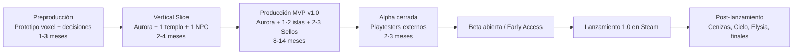

# 03-Diseno.md — DISEÑO DEL PROYECTO (PLAN INICIAL GENERICO)

**Modelo:** Deepseek V4 Flash
**Plataforma:** OpenCode
**Fecha:** 2026-08-15
**Componente:** 01-Fundamentos-Del-Proyecto
**Estado:** Documentación inicial (plan genérico)

---

## 1. Visión de Diseño

> **"Construye tu hogar. Descubre su pasado. Escucha al mundo."**

Un juego donde:
- **Construir** significa colaborar, no imponer (las modificaciones del terreno tienen consecuencias).
- **Explorar** significa descubrir historias, no solo lugares.
- **Las herramientas** sirven para comprender, no para destruir (cero violencia).
- **Los habitantes** son parte de la historia, no simples NPC.

---

## 2. Bucles de Juego (Core Loops)

### 2.1 Bucle Diario (20-45 min)

```
Picar/Recolectar recursos voxel
        │
        ▼
Decorar pueblo y hablar con vecinos
        │
        ▼
Vender excedentes y pagar mejoras de infraestructura
        │
        └─────── (reinicia al día siguiente) ───────┘
```

### 2.2 Bucle Semanal (Misterios)

```
Explorar ruinas/templos subterráneos
        │
        ▼
Resolver acertijos ambientales (luz, presión, agua, viento)
        │
        ▼
Obtener herramientas de aventura y Reliquias (Fragmentos de Sello)
```

### 2.3 Bucle Mensual (Expansión)

```
Comprar el Boleto de Pasaje (Gemas + Sello requerido)
        │
        ▼
Abordar el Gran Vapor / Dirigible (carga diegética)
        │
        ▼
Explorar una nueva isla temática
        │
        ▼
Desbloquear vecinos, flora rara y materiales únicos
```

---

## 3. Flujo del Jugador (Player Journey v1.0)

1. **Mes 1:** Llegada a Aurora (Isla Base). Tienda de campaña. Aprende a picar bloques, construye su primera casa, conoce a Finneas (Administrador) y los 2 primeros vecinos. Paga la primera cuota.
2. **Semana 2-3:** Descubre una grieta en las montañas. Entra al Templo de la Brisa (sin enemigos). Resuelve puzzles de luz y botones usando el Gancho Mecánico. Obtiene el **Sello de la Brisa** → el faro de Aurora se enciende.
3. **Día 1 del Mes 2:** El Gran Vapor atraca. Compra el **Boleto a las Islas de Coral** (Gemas de Ámbar + Sello de la Brisa).
4. **Viaje:** Explora la Isla de Coral. Descubre frutas tropicales, invita a un vecino nuevo y junta materiales raros. Regresa a Aurora a seguir expandiendo su hogar.
5. **(Opcional v1.0):** Templo de la Marea para el Sello de la Marea y la Vara de Flujo.

---

## 4. Arquitectura de Software

### 4.1 Estructura de Carpetas (independiente del motor — ver motor en 02-Analisis)

```
Assets/                              ← Unity (o estructura equivalente en Godot)
├── _Project/
│   ├── Scripts/
│   │   ├── Core/                    ← Bootstrapping, managers, service locator
│   │   ├── Gameplay/                ← Jugador, herramientas, interacción, construcción
│   │   ├── World/                   ← Voxel: chunks, meshing, generación, terreno
│   │   ├── Puzzle/                  ← Framework Emisor→Receptor, templos
│   │   ├── AI/                      ← NPC, rutinas, pathfinding, animales
│   │   ├── Economy/                 ← Wallets (Ámbar/Mérito), tiendas, infraestructura
│   │   ├── Narrative/               ← Diálogo, flags, misiones, historia
│   │   ├── Systems/                 ← Tiempo, calendario, clima, estaciones, eventos
│   │   ├── Audio/                   ← Managers de audio, mixers
│   │   ├── UI/                      ← Solo vistas; sin lógica de gameplay
│   │   ├── Data/                    ← ScriptableObjects de datos (bloques, recetas, NPC)
│   │   ├── Persistence/             ← GameState versionado, diffs de chunks, saves
│   │   └── Utils/                   ← Helpers, extensiones, math
│   ├── Prefabs/  Materials/  Textures/  Models/  Animations/
│   ├── Audio/  Scenes/  Shaders/  ScriptableObjects/
├── Editor/                          ← Build scripts, herramientas internas
├── Plugins/  StreamingAssets/
```

**Namespaces por sistema:** `IslaAncestral.Core`, `IslaAncestral.World`, `IslaAncestral.Puzzle`, `IslaAncestral.Economy`, etc.

### 4.2 Diagrama de Capas

```
┌──────────────────────────────────────────────┐
│ UI (Canvas/UGUI o Godot UI) — Vista           │  ← solo eventos, sin lógica
├──────────────────────────────────────────────┤
│ Managers / Servicios (singletons, locator)    │  ← orquestación
├──────────────────────────────────────────────┤
│ Systems: Voxel · Puzzle · Economy · AI ·      │
│          Narrative · Time/Weather · Audio      │  ← lógica de gameplay
├──────────────────────────────────────────────┤
│ Data (ScriptableObjects / Resources)          │  ← datos configurables
├──────────────────────────────────────────────┤
│ Persistence (GameState versionado + diffs)    │  ← guardado
└──────────────────────────────────────────────┘
```

### 4.3 Patrones y Contratos Clave

| Patrón | Uso |
|--------|-----|
| Event Bus / Observer | Reloj central (día, estación, clima) notifica a sistemas |
| Service Locator | Acceso a managers sin acoplar |
| ScriptableObject Architecture | Datos de bloques, recetas, NPC, diálogos |
| Interfaces | `IInteractable`, `ISignalEmitter`, `ISignalReceiver`, `IWorldState` |
| Composición | Prefabs modulares sobre herencia profunda |
| Command/Undo (opcional) | Modo construcción con deshacer |

---

## 5. Diseño del Sistema Voxel

| Concepto | Decisión |
|----------|----------|
| Tamaño de voxel | 1×1×1 m (coincide colisión, escala personaje ~1.8 m) |
| Tamaño de chunk | 16³ o 32³ voxels (evaluar en prototipo) |
| Procesamiento | Solo chunks activos en memoria; streaming por distancia |
| Malla | Face culling obligatorio; greedy meshing a evaluar |
| Hilos | Generación/remallado en hilos secundarios |
| LOD | Chunks lejanos simplificados |
| Colisiones | Raycast contra grilla de voxels (no contra malla) |
| Persistencia | Diffs por chunk (bloques vs. generación original) |
| Bloques líquidos | Agua, nieve, arena con comportamiento propio (evaluar) |
| Interacción | Pala (tierra/césped), Pico (piedra/minerales), Hacha (madera sin destruir árbol completo) |

---

## 6. Diseño del Framework de Puzzles (Emisor → Receptor)

```
[Emisor] ──señal──> [Medio transportador] ──señal──> [Receptor] ──acción──> [Mecanismo]

Ejemplos:
- Espejo (emisor de LUZ)  → haz guiado        → Receptor de luz → abre puerta
- Placa de presión (emisor de PESO)           → Receptor → activa plataforma
- Bloque deslizante (empujado por jugador)    → Receptor → cierra canal de agua
- Vara de Flujo (emisor AGUA/FRIO)            → Receptor → congela/evapora agua
- Gancho Mecánico (input del jugador)         → Punto de anclaje → cruza abismo
- Lanza-Semillas (input del jugador)          → Maceta lejana → crece planta → abre puerta
```

**Reglas de diseño:**
1. Toda mecánica de templo debe poder expresarse como combinación de emisor/receptor.
2. Las herramientas del jugador son "inputs" que activan receptores específicos.
3. Cada templo nuevo = componer piezas con skin temática distinta (SN); no programar mecánica nueva.
4. Pistas opcionales por templo; sin soluciones ambiguas; checkpoints y reinicio de puzzle.

---

## 7. Diseño de Datos (GameState)

```
GameState v1.0 (versionado)
├── Player: posición, inventario, hotbar, herramientas
├── Wallets: { gemasAmbar, pasesDeMerito }
├── Relations: { npcId → { puntosDeAmistad, nivel, flags } }
├── Progression: { sellos[], gRABACIONESescuchadas[], islasVisitadas[], historiaStage }
├── WorldDiffs: { chunkId → { bloqueModificado → tipoNuevo } }  (persistencia voxel incremental)
├── Crops: { parcelaId → { semilla, etapa, riego } }
├── Calendar: { fecha, hora, estacion, año }
└── Settings: { controles, accesibilidad, audio, graficos }
```

**Regla:** todo save incluye `schemaVersion`; las migraciones se ejecutan al cargar; los saves corruptos se detectan y se recuperan de backup.

---

## 8. Diseño del Sistema de Guardado

1. Autosave periódico + guardado manual en slots.
2. Serialización incremental: solo diffs de chunks modificados.
3. Escritura fuera del hilo principal; sin congelamientos.
4. Pruebas: apagado a mitad de guardado, falta de espacio, múltiples perfiles.

---

## 9. Estructura de Documentación del Proyecto

```
DOCUMENTACION/
├── 1-DOCUMENTO-DE-ESPECIFICACIONES-ACTUAL.md
├── 2-DOCUMENTO-DISENO-ACTUAL.md
├── 3-DOCUMENTO-TAREAS-ACTUAL.md
├── 4-DOCUMENTO-EJECUCION-ACTUAL.md
├── 5-FUTURAS-MEJORAS.md
├── 00-PLAN-INICIAL/                    ← Origen (no modificar)
├── 01-Fundamentos-Del-Proyecto/        ← ESTE componente
│   ├── plan-inicial/                   ← Base (no modificar)
│   └── plan-actual/                    ← Vigente (actualizar aquí)
├── 02-... hasta 152-... per módulo
├── INVESTIGACION SOBRE OTROS JUEGOS/
README.md (DOCUMENTACION)
```

---

## 10. Roadmap de Producción (Fases)



---

## 11. Decisiones de Diseño Cerradas (Resumen)

| # | Decisión | Estado |
|---|----------|--------|
| 1 | Cero violencia y cero penalizaciones violentas | CERRADA (filosofía del juego) |
| 2 | Framework de puzzles emisor→receptor | CERRADA |
| 3 | GameState versionado desde el día uno | CERRADA |
| 4 | Localización con claves desde el día uno | CERRADA |
| 5 | Escenas separadas con carga diegética entre islas | CERRADA |
| 6 | Diferenciación por narrativa + dirección de arte | CERRADA (estrategia) |
| 7 | Motor (Unity/Godot) | **ABIERTA** — se cierra en prototipo |
| 8 | Middleware de audio | **ABIERTA** — módulo 40 |
| 9 | Modelo de negocio (DLC vs gratis) | **ABIERTA** — módulo 94 |
| 10 | Multijugador | **ABIERTA** — módulo 75 |